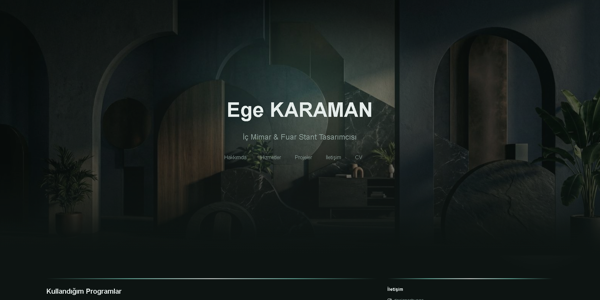
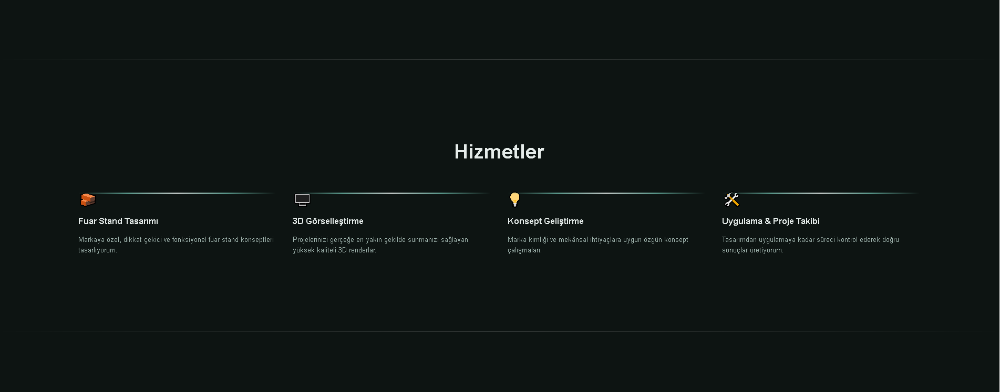
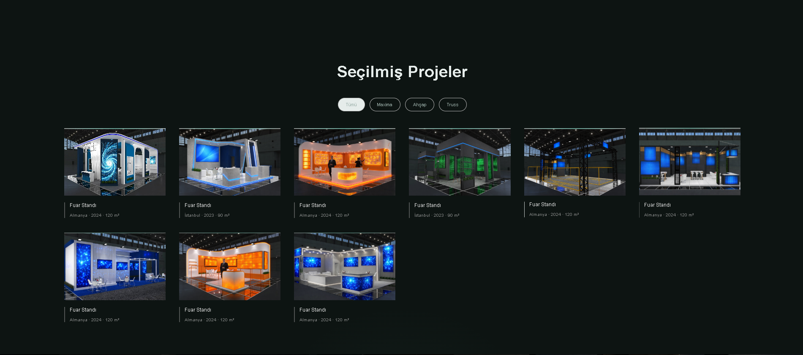
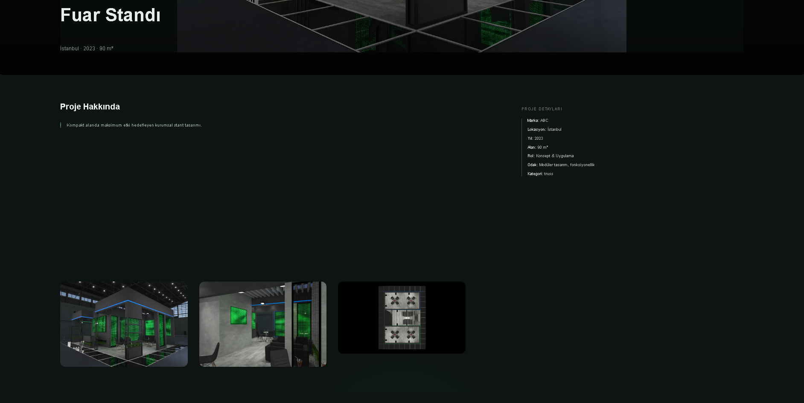
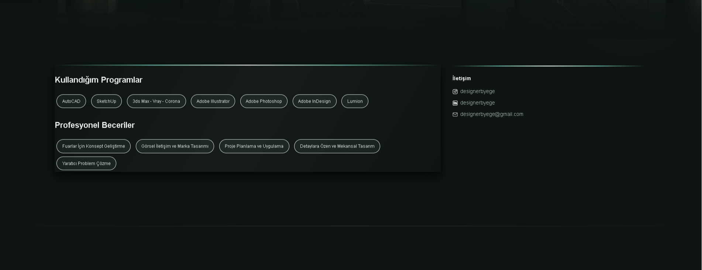
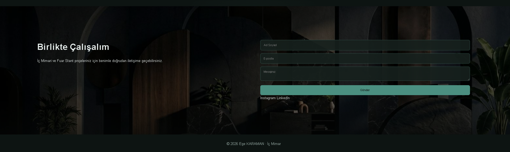

# İlayda Özsoy — Portfolio Website

Creative Developer & Digital Designer portfolio website.

## About

A personal portfolio website designed and developed by İlayda Özsoy to showcase software development, web development and digital design projects.

## Technologies

- HTML5
- CSS3
- JavaScript
- Responsive Web Design
- Git & GitHub

## Features

- Responsive portfolio website
- Project showcase
- Project detail pages
- Services section
- Skills and tools section
- Contact section
- CV section
- Interactive navigation
- Custom visual design

## Screenshots

### Homepage



### Services



### Projects



### Project Detail



### Skills



### Contact



## Project Structure

```text
ilaydaozsy-portfolio-website
│
├── assets/
│   └── cv/
│
├── css/
│   └── style.css
│
├── images/
│
├── js/
│   └── data.js
│
├── screenshots/
│
├── index.html
├── project.html
├── .gitignore
└── README.md

Developer

İlayda Özsoy

Computer Programming Graduate
Junior Software Developer | Digital Designer

License

This project was created for portfolio and professional presentation purposes.
