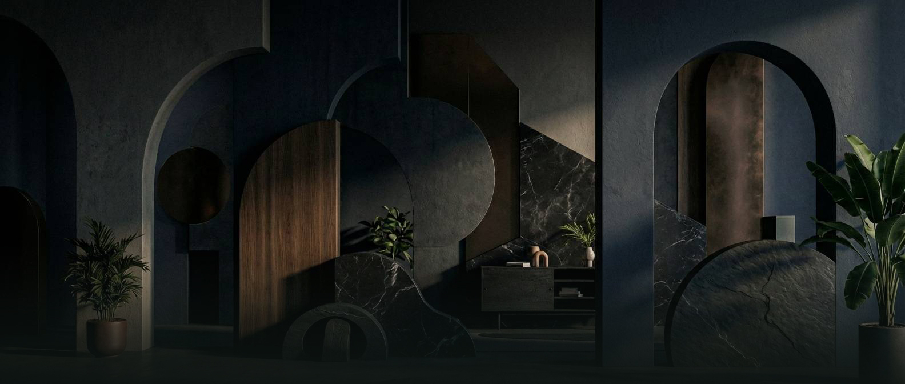

# 🎨 İlayda Özsoy — Portfolio Website

A personal portfolio website designed and developed to showcase web development, software development, UI design, and digital design projects.

---

## ✨ Overview

This project is an early portfolio website concept created as a personal design and development project.

The website focuses on presenting projects through a visual, clean, and project-oriented interface while combining web development and digital design.

The project was fully designed and developed by **İlayda Özsoy**.

---

## 🚀 Features

- 🎨 Personal portfolio homepage
- 💻 Software development project showcase
- 🌐 Web development project presentation
- 🖥️ Digital design project showcase
- 📁 Project categories
- 🔎 Individual project detail pages
- 🖼️ Image-based project presentations
- 📱 Responsive web design
- ✨ Custom visual design
- ⚡ JavaScript interactions
- 📄 Structured project data

---

## 🛠️ Technologies

### Frontend

- HTML5
- CSS3
- JavaScript

### Design & Development

- Responsive Web Design
- Custom UI Design
- Visual Design
- Project-based Content Presentation

---

## 📸 Preview



---

## 📂 Project Structure

```text
ilaydaozsy-portfolio-website
│
├── assets/
│   └── cv/
│
├── css/
│   └── style.css
│
├── images/
│   ├── header.jpeg
│   ├── p1-1.jpeg
│   ├── p2-1.jpeg
│   ├── p2-2.jpeg
│   ├── ...
│   └── p9-1.jpeg
│
├── js/
│   └── data.js
│
├── index.html
└── project.html
